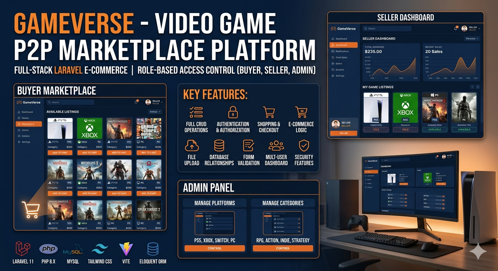

# 🎮 GameVerse – Video Game P2P Marketplace Platform

<div align="center">
  


**A modern, full-stack peer-to-peer marketplace for buying and selling video games** 🚀

[Features](#-features) • [Tech Stack](#-tech-stack) • [Installation](#-installation) • [Usage](#-usage) • [Legal](#⚖️-legal-notice) • [Contributing](#-contributing)

</div>

---

## 📸 Project Overview

<p align="center">
  
</p>

### 🎯 What is GameVerse?

**GameVerse** is a cutting-edge e-commerce platform that revolutionizes how gamers buy and sell video games. With dual-role authentication, secure transactions, and real-time inventory management, GameVerse creates a vibrant community connecting game enthusiasts worldwide.

---

## 🌟 Features

### 👥 User Role System
- **Buyers** 🛍️: Browse, add games to cart, and checkout seamlessly
- **Sellers** 💳: List games for sale, track inventory, and monitor earnings
- **Admins** 👨‍💼: Manage platforms and game categories with full control

### 🎮 Core Functionality
✅ **User Authentication & Authorization**
- Secure registration and email verification
- Role-based access control (RBAC) middleware
- Password hashing and session management

✅ **Game Marketplace**
- Add games with detailed information (title, price, platform, category, release date)
- Upload and validate game images (JPEG, PNG, GIF, max 2MB)
- Real-time availability tracking
- Advanced filtering by platform and category

✅ **Shopping & Checkout**
- Dynamic shopping cart with add/remove functionality
- Real-time game availability verification
- One-click secure checkout
- Transaction history tracking

✅ **Seller Dashboard**
- View all listed games (sold/unsold)
- Monitor total earnings
- Delete unsold games
- Track buyer information

✅ **Buyer Dashboard**
- Browse all available games from sellers
- View game details with seller information
- Purchase history
- Wishlist functionality

✅ **Admin Panel**
- Manage game platforms (PlayStation, Xbox, PC, Nintendo, etc.)
- Create and organize game categories (RPG, Action, Adventure, Indie, etc.)
- View marketplace statistics
- User management

---

## 🛠️ Tech Stack

| Layer | Technologies |
|-------|---------------|
| **Backend** | Laravel 11, PHP 8.x, Eloquent ORM |
| **Frontend** | Blade Templates, Tailwind CSS 3.0, Alpine.js |
| **Database** | MySQL 8.0 |
| **Build Tools** | Vite.js, PostCSS, npm |
| **Authentication** | Laravel Breeze, Laravel Middleware |
| **Testing** | Pest PHP |
| **API** | RESTful API endpoints with JSON responses |
| **File Storage** | Local file system (/public/images/games) |

---

## 📊 Database Structure

```
Users (auth users, sellers, buyers, admins)
├── Games (stored by sellers)
│   ├── Platform (belongs to one platform)
│   ├── Category
│   ├── Buyer Info (after purchase)
│   └── Image URL
├── Platforms (PS5, Xbox, PC, Nintendo)
├── Categories (RPG, Action, Indie, etc.)
└── Announcements (optional marketplace listings)
```

---

## 🚀 Installation

### Prerequisites
- **PHP** 8.1+ ([Download](https://www.php.net/))
- **Composer** ([Download](https://getcomposer.org/))
- **Node.js** 16+ ([Download](https://nodejs.org/))
- **MySQL** 8.0+ ([Download](https://www.mysql.com/))
- **Git** ([Download](https://git-scm.com/))

### Step-by-Step Setup

#### 1️⃣ Clone the Repository
```bash
git clone https://github.com/yourusername/gameverse.git
cd gameverse
```

#### 2️⃣ Install PHP Dependencies
```bash
composer install
```

#### 3️⃣ Install Node Dependencies
```bash
npm install
```

#### 4️⃣ Create Environment File
```bash
cp .env.example .env
```

#### 5️⃣ Generate Application Key
```bash
php artisan key:generate
```

#### 6️⃣ Configure Database
Edit `.env` file and set your database credentials:
```env
DB_CONNECTION=mysql
DB_HOST=127.0.0.1
DB_PORT=3306
DB_DATABASE=gameverse
DB_USERNAME=root
DB_PASSWORD=your_password
```

#### 7️⃣ Run Migrations
```bash
php artisan migrate
```

#### 8️⃣ Seed Database (Optional)
```bash
php artisan db:seed
```

#### 9️⃣ Build Frontend Assets
```bash
npm run build
```

#### 🔟 Start Development Server
```bash
php artisan serve
```

Visit: `http://localhost:8000`

---

## 📖 Usage Guide

### For Buyers 🛍️

1. **Register Account**
   - Create account with email and password
   - Select "Buyer" as account type
   - Verify email address

2. **Browse Games**
   - Visit homepage to see all available games
   - Filter by platform or category
   - Click game to view details

3. **Add to Cart**
   - Click "Add to Cart" button
   - Review shopping cart
   - Proceed to checkout

4. **Complete Purchase**
   - Enter payment/shipping information
   - Confirm order
   - Receive confirmation email

### For Sellers 💳

1. **Register Account**
   - Create account with email and password
   - Select "Seller" as account type
   - Verify email address

2. **List a Game**
   - Navigate to "Add Game"
   - Fill in game details:
     - Game name, description
     - Release date, platform, category
     - Price (USD)
     - Upload game image
   - Submit listing

3. **Manage Inventory**
   - View all your games in seller dashboard
   - Track sold vs. unsold games
   - Monitor total earnings
   - Delete unsold games anytime

4. **Track Sales**
   - View buyer information for sold games
   - Check earnings report
   - Download invoice if needed

### For Admins 👨‍💼

1. **Access Admin Dashboard**
   - Register with admin privileges
   - Navigate to `/admin/dashboard`

2. **Manage Platforms**
   - Go to `/admin/platforms`
   - Add new gaming platforms
   - Edit or delete existing platforms

3. **Manage Categories**
   - Go to `/admin/categories`
   - Create game categories
   - Modify or remove categories

4. **View Statistics**
   - Total games listed
   - Total sales
   - Active users
   - Platform analytics

---

## 🔧 API Endpoints

### Games
```http
GET    /                          # List all games
GET    /add-jeu                   # Game creation form
POST   /store-jeu                 # Create new game
DELETE /jeux/{id}                 # Delete game (seller only)
POST   /api/cart-items            # Get cart items with price
```

### Authentication
```http
POST   /register                  # User registration
POST   /login                     # User login
POST   /logout                    # User logout
GET    /dashboard                 # User dashboard
```

### Checkout
```http
GET    /checkout                  # Checkout page
POST   /checkout                  # Process purchase
```

### Admin
```http
GET    /admin/dashboard           # Admin dashboard
GET    /admin/platforms           # Platform management
POST   /admin/platforms           # Create platform
DELETE /admin/platforms/{id}      # Delete platform
GET    /admin/categories          # Category management
POST   /admin/categories          # Create category
DELETE /admin/categories/{id}     # Delete category
```

---

## 🔐 Security Features

| Feature | Implementation |
|---------|-----------------|
| **Password Hashing** | bcrypt with Laravel Hash facade |
| **CSRF Protection** | @csrf token on all forms |
| **Authorization** | Middleware-based role checking |
| **Input Validation** | Server-side form validation |
| **File Upload Security** | MIME type & size validation |
| **SQL Injection Prevention** | Eloquent ORM parameterized queries |
| **Email Verification** | Mandatory before account access |
| **Ownership Verification** | Game deletion restricted to owner |

---

## ⚖️ Legal Notice & Warnings

### ⚠️ IMPORTANT DISCLAIMERS

#### 1. **Terms of Service**
By using GameVerse, users agree to abide by all applicable laws and regulations. Users must:
- Be at least 18 years old (or have parental consent)
- Own legitimate copies of games they sell
- Not engage in fraudulent or illegal activity
- Respect intellectual property rights

#### 2. **Intellectual Property Rights**
- **Game Copyrights**: All video game titles, logos, and content are owned by their respective publishers
- **Platform Trademarks**: PlayStation®, Xbox®, Nintendo® are registered trademarks
- **Platform Logo**: This platform is **NOT** affiliated with any game publisher or console manufacturer
- **Permission Required**: Users may not sell games without owning valid licenses

#### 3. **Liability Disclaimer**
```
THE PLATFORM IS PROVIDED "AS-IS" WITHOUT ANY WARRANTIES, EXPRESS OR IMPLIED.
The operator is NOT liable for:
- Fraudulent transactions or disputes between users
- Stolen or counterfeit game copies
- Loss of digital content or access keys
- Third-party payment failures
- Unauthorized account access (user responsible for password security)
```

#### 4. **User Responsibilities**
- **Sellers MUST**: Guarantee authentic, legitimate game copies
- **Buyers ASSUME**: Risk of seller authenticity and game condition
- **Both MUST**: Report suspicious activity immediately

#### 5. **Payment & Transactions**
- All transactions are final (except in cases of fraud)
- Platform fees apply (currently 0% for beta testing)
- Refund policy: See detailed terms on platform
- Payment processing via [Payment Provider Name]

#### 6. **Data Privacy**
- Personal data is collected and stored securely
- Data is never sold to third parties
- GDPR and CCPA compliant
- Users can request data deletion anytime
- See [Privacy Policy](PRIVACY.md) for details

#### 7. **Prohibited Activities**
Users shall NOT:
- ❌ Sell pirated, cracked, or illegally obtained games
- ❌ Engage in price manipulation or market manipulation
- ❌ Harass, threaten, or abuse other users
- ❌ Access the platform through automated means (bots, scrapers)
- ❌ Attempt to breach security or hack accounts
- ❌ Post illegal, defamatory, or offensive content
- ❌ Use the platform for money laundering or fraud

#### 8. **Consequences of Violation**
Violations may result in:
- Account suspension or permanent ban
- Legal action and prosecution
- Cooperation with law enforcement
- Civil liability for damages

#### 9. **Age Restrictions**
- Minimum age: 18 years
- Parental consent required for minors
- Platform does NOT facilitate underage gaming purchases
- ESRB/PEGI age ratings are advisory only

#### 10. **Game License Terms**
- Games sold are for **PERSONAL USE ONLY**
- Reselling is at user's legal risk
- Some publishers prohibit resale in terms of service
- Platform assumes no liability for publisher disputes

---

## 🤝 Contributing

We welcome contributions! Please follow these steps:

### 1. Fork the Repository
```bash
git clone https://github.com/yourusername/gameverse.git
cd gameverse
```

### 2. Create a Feature Branch
```bash
git checkout -b feature/amazing-feature
```

### 3. Commit Your Changes
```bash
git commit -m 'Add some amazing feature'
```

### 4. Push to Branch
```bash
git push origin feature/amazing-feature
```

### 5. Open a Pull Request
- Describe changes clearly
- Reference related issues
- Follow code style guidelines

### Code Style Guidelines
- PSR-12 PHP coding standard
- 4-space indentation
- Use meaningful variable names
- Comment complex logic
- Write unit tests for new features

---

## 📋 Project Roadmap

- [x] Basic user authentication
- [x] Game marketplace functionality
- [x] Shopping cart & checkout
- [x] Seller dashboard
- [x] Admin panel
- [ ] Payment gateway integration
- [ ] Wishlist feature
- [ ] Game ratings & reviews
- [ ] Message system (seller-buyer)
- [ ] Advanced search & filters
- [ ] Mobile app (React Native)
- [ ] Email notifications
- [ ] Analytics dashboard

---

## 📝 License

This project is licensed under the **MIT License** – see the [LICENSE](LICENSE) file for details.

```
MIT License

Copyright (c) 2026 GameVerse

Permission is hereby granted, free of charge, to any person obtaining a copy
of this software and associated documentation files (the "Software"), to deal
in the Software without restriction, including without limitation the rights
to use, copy, modify, merge, publish, distribute, sublicense, and/or sell
copies of the Software, and to permit persons to whom the Software is
furnished to do so, subject to the following conditions:

The above copyright notice and this permission notice shall be included in all
copies or substantial portions of the Software.
```

---

## 👨‍💻 Author

**Your Name/Team**
- GitHub: [@yourusername](https://github.com/yourusername)
- Email: your.email@example.com
- LinkedIn: [Your Profile](https://linkedin.com/in/yourprofile)

---

## 🙋 Support & Issues

Have questions or found a bug? 
- **Report Issues**: [GitHub Issues](https://github.com/yourusername/gameverse/issues)
- **Discussions**: [GitHub Discussions](https://github.com/yourusername/gameverse/discussions)
- **Email Support**: support@gameverse.com

---

## 🎓 Learning Resources

- [Laravel Documentation](https://laravel.com/docs)
- [Eloquent ORM Guide](https://laravel.com/docs/eloquent)
- [Tailwind CSS Docs](https://tailwindcss.com/docs)
- [PHP Best Practices](https://www.php-fig.org/)

---

<div align="center">

**Made with ❤️ by the GameVerse Team**

⭐ **If you found this helpful, please star the repository!** ⭐

[⬆ back to top](#-gameverse--video-game-pp-marketplace-platform)

</div>
